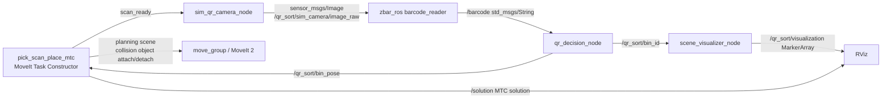

# Architecture

## Motion Pipeline

1. Insert `workpiece`, `pick_station_support`, and open-top bin floor/wall boxes as MoveIt collision objects.
2. Plan pick-to-scan and publish `/qr_sort/scan_ready`.
3. Wait for QR decision output on `/qr_sort/bin_pose`.
4. Plan the complete pick-scan-place MTC task with gripper width open/close stages, a grasp-center IK offset, collision allowance, attach, top-down bin approach, detach, retreat, and home stages.
5. Publish the MTC solution on `/solution` for RViz Motion Planning Tasks.

## Perception Pipeline

1. `sim_qr_camera_node` renders the configured QR text into a real QR image.
2. It waits until `/qr_sort/scan_ready` is true before publishing images.
3. `zbar_ros` subscribes to `/qr_sort/sim_camera/image_raw` through the `image` remap.
4. Decoded text is published on `/barcode`.
5. `qr_decision_node` maps text to `bin_a`, `bin_b`, `bin_c`, or `reject_bin`.

## Simulation Boundary

This is a MoveIt/RViz simulation. QR perception is exercised through a generated image and `zbar_ros`, but no Gazebo camera, physical camera, or real robot controller is claimed. The scan trigger is produced when the MTC pick-to-scan solution reaches the scan stage, so it is correct for planning demonstration but not a hardware sensor callback.

## Requirement Alignment

| Rubric area | Evidence |
| --- | --- |
| System functionality | Pick-to-scan task, zbar decode, bin decision, full MTC place task |
| ROS 2 architecture | Separate bringup, logic, visualization, camera, zbar, and MTC nodes |
| Motion planning | MoveIt 2 and MTC with collision object attach/detach, open-top bin collisions, and width-controlled Panda gripper stages |
| QR scanning | Real QR image generated and decoded through `zbar_ros` |
| Code quality | Parameters in YAML, modular packages, commented key motion code |
| Report quality | README, architecture diagram, test plan, report skeleton, presentation outline |
