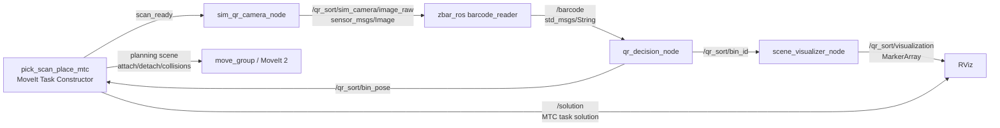

# QR-Based Robotic Pick-Scan-Place Sorting Cell

**Course:** MAI605 - Robotic Systems  
**Project:** Course Project I - ROS 2 Robotic Manipulation Pipeline  
**Robot Platform:** Franka Emika Panda using `moveit_resources_panda_moveit_config`  
**Software Stack:** Ubuntu 22.04, ROS 2 Humble, MoveIt 2, MoveIt Task Constructor, zbar_ros, RViz  
**Repository:** `git@github.com:3bo0d7/ros2_wc_MAI605.git`

## Abstract

This report presents a ROS 2 Humble robotic manipulation system developed for the MAI605 Robotic Systems project. The system implements an industrial-style pick-scan-place workflow in which a robot picks a QR-labeled object from a fixed station, moves it to a scanning pose, decodes the QR code using `zbar_ros`, maps the decoded result to a destination bin, and plans a placement motion to the selected bin. The implementation uses a Panda robot model, MoveIt 2, MoveIt Task Constructor, modular ROS 2 packages, YAML parameters, launch files, RViz visualization, and documented test evidence.

The final implementation emphasizes a defensible simulation rather than overclaiming unsupported hardware features. QR perception is exercised through a simulated ROS image publisher that generates a real QR image, which is decoded by `zbar_ros`. Manipulation is planned in MoveIt using collision objects for the workpiece, the pick support, and open-top bin geometry. The workpiece is attached and detached in the planning scene so the planned motion shows the object being carried by the robot.

## 1. Project Description

The project brief requires a complete ROS 2 based robotic manipulation pipeline. The required workflow is:

1. Pick an object from a fixed station.
2. Move the object to a predefined scanning pose.
3. Decode the object's QR code.
4. Process the decoded data using decision logic.
5. Place the object into a designated bin according to the QR content.
6. Demonstrate perception, planning, and control behavior in simulation.

The assignment constraints allow a static object, a simple grasp, a predefined scan pose, and no object pose perception. Based on the available environment, the project uses a Panda robot from the MoveIt resources packages rather than a custom MyCobot model. The current simulation is RViz and MoveIt based rather than Gazebo or Isaac physics simulation.

## 2. Project Objectives and Requirement Alignment

The implementation was developed against the course objectives and grading rubric. Table 1 summarizes the alignment between the project requirements and the implemented system.

**Table 1. Requirement traceability**

| Requirement | Implementation evidence |
| --- | --- |
| ROS 2 Humble or newer | Workspace runs on ROS 2 Humble in Ubuntu 22.04 under WSL |
| At least 5 DOF robot | Panda robot with 7 arm joints and gripper from `moveit_resources_panda_moveit_config` |
| MoveIt 2 planning environment | `move_group` and MoveIt Task Constructor are used for planning |
| Pick, scan, and place phases | MTC task stages implement ready, pick, approach, grasp, attach, lift, scan, bin approach, lower, release, detach, retreat, and home |
| Collision-free trajectories | MoveIt planning scene contains collision objects for the workpiece, pick support, and open-top bin walls/floors |
| QR perception with zbar_ros | Simulated camera publishes a real QR image to `/qr_sort/sim_camera/image_raw`; `zbar_ros` decodes to `/barcode` |
| QR decision logic | `qr_decision_node` maps decoded text to `/qr_sort/bin_id` and `/qr_sort/bin_pose` |
| Modular ROS 2 software | Three packages separate bringup, decision/perception/visualization, and MTC planning |
| Parameters and launch files | Shared YAML parameters and `qr_sorting_demo.launch.py` configure the full demo |
| Simulation evidence | RViz robot display, MarkerArray workcell, MTC solution on `/solution`, and test logs |
| Documentation | README, architecture notes, test plan, presentation outline, and this technical report |

## 3. System Architecture

The system is organized around separate ROS 2 nodes for motion planning, QR image generation, QR decoding, decision logic, and visualization. This separation improves testability and matches ROS 2 software engineering practice.



### 3.1 Packages

The workspace contains three project packages:

| Package | Responsibility |
| --- | --- |
| `qr_sorting_bringup` | Launch file and shared YAML configuration |
| `qr_sorting_logic` | Simulated QR camera, QR decision logic, test injection, and RViz workcell markers |
| `qr_sorting_mtc` | MoveIt Task Constructor implementation of the pick-scan-place planning task |

### 3.2 Main Topics

| Topic | Type | Purpose |
| --- | --- | --- |
| `/qr_sort/sim_camera/image_raw` | `sensor_msgs/Image` | Simulated QR camera image |
| `/barcode` | `std_msgs/String` | Decoded QR output from `zbar_ros` |
| `/qr_sort/bin_id` | `std_msgs/String` | Selected logical bin ID |
| `/qr_sort/bin_pose` | `geometry_msgs/PoseStamped` | Selected placement target |
| `/qr_sort/scan_ready` | `std_msgs/Bool` | Trigger indicating the robot has planned to the scan pose |
| `/qr_sort/visualization` | `visualization_msgs/MarkerArray` | RViz workcell markers |
| `/solution` | MoveIt Task Constructor solution topic | RViz Motion Planning Tasks display |

## 4. Robot and Workcell Model

The project uses the Panda robot from the official MoveIt resources packages. This choice was made because the target environment did not include MyCobot packages and the course requirement allows any robot with at least 5 DOF. The Panda model provides a complete MoveIt 2 configuration, SRDF groups, controllers, and RViz integration.

Important robot configuration values are:

| Parameter | Value |
| --- | --- |
| Planning group | `panda_arm` |
| Gripper group | `hand` |
| End-effector frame | `panda_hand` |
| Base frame | `panda_link0` |
| Ready state | `ready` |
| Workpiece ID | `workpiece` |
| Workpiece size | 0.06 m x 0.06 m x 0.06 m |

The workcell contains:

- A fixed pick station.
- A QR-labeled cube workpiece.
- A scan station with RViz camera/frustum markers.
- Four open-top sorting bins: `bin_a`, `bin_b`, `bin_c`, and `reject_bin`.
- A visual table/workcell surface.

The open-top bins are represented in two ways. First, RViz markers show square containers with side walls and a top rim for presentation. Second, MoveIt collision objects represent each bin as a floor plus four walls so the planned placement path respects the bin geometry.

## 5. Motion Planning Pipeline

Motion planning is implemented in `qr_sorting_mtc/src/pick_scan_place_mtc.cpp` using MoveIt Task Constructor. The task is split logically into two phases:

1. **Pick-to-scan planning:** the robot plans from the current state to the pick station, grasps and attaches the object, lifts it, and moves to the QR scan pose.
2. **Scan-to-place planning:** after QR decision output is available, the robot plans the full sequence to place the attached object into the selected bin.

This split improves the logical timing of the scan stage. The simulated QR camera waits for `/qr_sort/scan_ready`, so the QR image is not published until the robot has reached the scan stage in the planned task.

### 5.1 MTC Stage Sequence

The final task tree contains the following stages:

1. `current state`
2. `move to ready`
3. `open gripper before pick`
4. `allow gripper-object contact`
5. `move to pick pose`
6. `approach object`
7. `close gripper on object`
8. `attach workpiece to gripper`
9. `lift attached object`
10. `move attached object to QR scan pose`
11. `move attached object above selected bin opening`
12. `lower attached object into bin`
13. `open gripper at bin`
14. `detach workpiece in bin`
15. `retreat from bin`
16. `return home`
17. `forbid gripper-object contact after release`

### 5.2 Collision Object Handling

The workpiece is inserted into the MoveIt planning scene as a collision object named `workpiece`. During the grasp stage, collision between the gripper links and the workpiece is temporarily allowed. After the close stage, the object is attached to `panda_hand` using `stages::ModifyPlanningScene::attachObject`. At the selected bin, the gripper opens, the object is detached, and collision checking is restored.

The pick support is also inserted as a collision object named `pick_station_support`. The larger table is kept as a visual marker instead of a full collision object because a full tabletop collision model blocked the simplified Panda ready/pick states during early testing.

### 5.3 Gripper Realism

The Panda SRDF `close` state fully closes the finger joints to zero, which makes the gripper visually pass through a 6 cm cube. To make the grasp more defensible, the project uses:

- `gripper_open_width: 0.04`
- `gripper_grasp_width: 0.028`
- `grasp_frame_offset: [0.0, 0.0, 0.1034]`

The width target makes the gripper close around the exterior sides of the cube rather than closing through it. The grasp-frame offset treats the commanded pose as the grasp center, keeping the Panda palm and finger base outside the object while the fingers clamp the sides.

### 5.4 Bin Placement

The bin placement was changed from a direct move to a selected bin pose into a more realistic sequence:

1. Move above the selected bin opening.
2. Lower vertically into the open top.
3. Open the gripper.
4. Detach the workpiece.
5. Retreat vertically upward.

This behavior is more consistent with collision-aware placement because the gripper does not move through bin walls or neighboring objects.

## 6. QR Perception Pipeline

The course brief requires integration with `zbar_ros`. The implementation keeps `zbar_ros` in the perception path while using a simulated camera image source.

The node `sim_qr_camera_node.py` generates a real QR code image using the configured `qr_text` launch argument. It publishes the image on:

```text
/qr_sort/sim_camera/image_raw
```

The `zbar_ros` barcode reader subscribes to this image topic through a launch remap and publishes decoded text on:

```text
/barcode
```

The decision node subscribes to `/barcode`. If `zbar_ros_interfaces` is available, the node can also subscribe to `/symbol`, but `/barcode` with `std_msgs/String` is used as the reliable Humble-compatible path in this environment.

## 7. Decision Logic

The decision logic is implemented in `qr_decision_node.py`. It maps QR content to a configured bin ID and pose. The mapping is parameterized in `qr_sorting_bringup/config/qr_sorting.yaml`.

**Table 2. QR decision mapping**

| QR input | Bin ID | Bin pose center |
| --- | --- | --- |
| `BIN_A` | `bin_a` | `[0.30, 0.50, 0.35]` |
| `BIN_B` | `bin_b` | `[0.50, 0.28, 0.35]` |
| `BIN_C` | `bin_c` | `[0.30, -0.50, 0.35]` |
| Unknown or invalid text | `reject_bin` | `[0.50, -0.28, 0.35]` |

The node publishes:

- `/qr_sort/bin_id` for visualization and debugging.
- `/qr_sort/bin_pose` for the MTC planner.

## 8. Launch and Configuration

The main launch file is:

```text
qr_sorting_bringup/launch/qr_sorting_demo.launch.py
```

It launches:

- Panda robot description and MoveIt configuration.
- `robot_state_publisher`.
- `joint_state_publisher`.
- `move_group`.
- RViz when `launch_rviz:=true`.
- Simulated QR camera node.
- `zbar_ros` barcode reader.
- QR decision node.
- RViz scene visualizer node.
- MTC pick-scan-place node.

The system is configured through:

```text
qr_sorting_bringup/config/qr_sorting.yaml
```

The most important parameters include bin poses, gripper widths, object size, scan pose, pick pose, collision dimensions, and motion distances.

## 9. Simulation and Visualization

The project is currently demonstrated in RViz and MoveIt. This is consistent with the project brief, which allows Gazebo, Isaac, or RViz simulation. RViz is used to show:

- Panda robot model.
- Motion Planning Tasks tree and solution on `/solution`.
- Workpiece at the fixed station.
- QR panel on the workpiece marker.
- Scanner and camera/frustum markers.
- Open-top bin markers.
- Selected-bin highlight.
- Planned route line.

The visualization is intentionally simple and explanatory. It is not a physics simulation. The report and repository do not claim a Gazebo camera, real camera, conveyor, or real robot execution.

## 10. Testing and Evidence

### 10.1 Build Test

The project builds with:

```bash
cd ~/ros2_ws
source /opt/ros/humble/setup.bash
colcon build --symlink-install --packages-select qr_sorting_mtc qr_sorting_logic qr_sorting_bringup
source install/setup.bash
```

Expected result:

```text
Summary: 3 packages finished
```

### 10.2 Functional Tests

Each QR case was tested using the launch file:

```bash
ros2 launch qr_sorting_bringup qr_sorting_demo.launch.py qr_text:=BIN_A launch_rviz:=false
ros2 launch qr_sorting_bringup qr_sorting_demo.launch.py qr_text:=BIN_B launch_rviz:=false
ros2 launch qr_sorting_bringup qr_sorting_demo.launch.py qr_text:=BIN_C launch_rviz:=false
ros2 launch qr_sorting_bringup qr_sorting_demo.launch.py qr_text:=UNKNOWN launch_rviz:=false
```

For the final collision-aware layout, all four cases produced a successful pick-to-scan plan, QR decode, bin mapping, and full MTC plan.

**Table 3. Test evidence summary**

| Test case | Expected decision | Observed planning result |
| --- | --- | --- |
| `BIN_A` | `bin_a` | Pick-to-scan succeeded, zbar decoded, full plan succeeded |
| `BIN_B` | `bin_b` | Pick-to-scan succeeded, zbar decoded, full plan succeeded |
| `BIN_C` | `bin_c` | Pick-to-scan succeeded, zbar decoded, full plan succeeded |
| `UNKNOWN` | `reject_bin` | Pick-to-scan succeeded, zbar decoded, full plan succeeded |

Representative log lines:

```text
Pick-to-scan planning succeeded. Solutions: 1
Scan trigger received. Publishing QR images for zbar_ros decode.
QR "BIN_A" from /barcode mapped to bin_a
Planning succeeded. Solutions: 1
```

### 10.3 Debug Topics

The following commands are useful for evidence collection:

```bash
ros2 topic echo /barcode
ros2 topic echo /qr_sort/bin_id
ros2 topic echo /qr_sort/bin_pose
ros2 topic echo /qr_sort/scan_ready
ros2 topic echo /qr_sort/visualization
```

## 11. Challenges and Solutions

### 11.1 MoveIt PlanningSceneInterface Header

An early build failed because the wrong Humble include path was used for `PlanningSceneInterface`. The correct include is:

```cpp
#include <moveit/planning_scene_interface/planning_scene_interface.h>
```

The package dependencies were updated to include MoveIt planning interface libraries.

### 11.2 Object Carry Behavior

The initial version moved the robot through poses but did not convincingly carry the object. This was corrected by inserting the workpiece as a MoveIt collision object and using MTC `ModifyPlanningScene` stages to attach and detach it.

### 11.3 Scan Timing

A single monolithic task could allow QR decoding before the robot logically reached the scan pose. The implemented solution plans the pick-to-scan phase first and publishes `/qr_sort/scan_ready`. The simulated QR camera waits for that trigger before publishing images.

### 11.4 Gripper and Object Alignment

The Panda gripper's fully closed named state made the fingers pass through the object. The final implementation uses finger-width targets and a grasp-frame offset so the fingers hold the cube sides and the palm does not enter the cube.

### 11.5 Collision-Aware Bins

Solid visual bin markers were not sufficient for planning because the robot could appear to pass through them. The final version adds open-top bin collision objects to the MoveIt planning scene and uses a top-down place motion through the bin opening.

### 11.6 RViz and WSL Issues

RViz under WSL may show GUI warnings such as runtime directory permissions or unsupported stereo. These do not affect planning. If the RViz window cannot be moved, the WSL runtime directory permissions can be repaired with:

```bash
sudo chmod 700 /run/user/1000
export XDG_RUNTIME_DIR=/run/user/1000
```

## 12. Limitations

The current system satisfies the main project workflow in RViz and MoveIt simulation, but it has the following limitations:

- It does not use Gazebo or Isaac physics simulation.
- It does not use a real camera or Gazebo camera sensor.
- The QR image is generated by a simulated camera node.
- The scan trigger is planning based rather than a hardware sensor callback.
- Execution is disabled by default with `execute: false`; the main demonstration path is RViz Motion Planning Tasks animation and inspection.
- The Panda robot is used because MyCobot packages were not installed in the available environment.
- The system assumes a fixed object pose and does not perform pose estimation.

These limitations are acceptable within the assignment constraints as long as they are stated clearly. The project demonstrates the required perception, planning, decision, and simulated manipulation pipeline.

## 13. How to Run the Demo

Clean stale ROS nodes:

```bash
pkill -INT -f move_group || true
pkill -INT -f rviz2 || true
pkill -INT -f robot_state_publisher || true
pkill -INT -f joint_state_publisher || true
pkill -INT -f pick_scan_place_mtc || true
pkill -INT -f barcode_reader || true
pkill -INT -f qr_decision_node || true
pkill -INT -f scene_visualizer_node || true
pkill -INT -f sim_qr_camera_node || true
sleep 3
ros2 daemon stop
ros2 daemon start
```

Build and launch:

```bash
cd ~/ros2_ws
source /opt/ros/humble/setup.bash
colcon build --symlink-install --packages-select qr_sorting_mtc qr_sorting_logic qr_sorting_bringup
source install/setup.bash
ros2 launch qr_sorting_bringup qr_sorting_demo.launch.py qr_text:=BIN_A launch_rviz:=true
```

In RViz:

1. Add a `MarkerArray` display for `/qr_sort/visualization`.
2. Set Motion Planning Tasks `Task Solution Topic` to `/solution`.
3. Inspect or animate the MTC solution.

## 14. Conclusion

The project implements a complete ROS 2 pick-scan-place sorting pipeline that matches the MAI605 brief. The system uses a Panda robot, MoveIt 2, MoveIt Task Constructor, `zbar_ros`, modular ROS 2 nodes, YAML parameters, and RViz visualization. The final version includes collision-aware object handling, realistic gripper-side grasp behavior, QR-triggered decision logic, and top-down placement into open-top bin collision geometry.

The implemented workflow demonstrates the required integration of perception, planning, and simulated control behavior:

```text
fixed station -> pick -> attach -> scan pose -> zbar QR decode -> decision logic -> selected bin -> lower -> detach -> retreat
```

The project is ready for demonstration and oral assessment, with clear documentation of architecture, testing, limitations, and engineering decisions.

## References

1. MAI605 Robotic Systems Course Project I brief, Dr. Omar Shalash.
2. ROS 2 Humble documentation.
3. MoveIt 2 and MoveIt Task Constructor documentation.
4. `zbar_ros` package documentation.
5. `moveit_resources_panda_moveit_config` Panda MoveIt example configuration.

